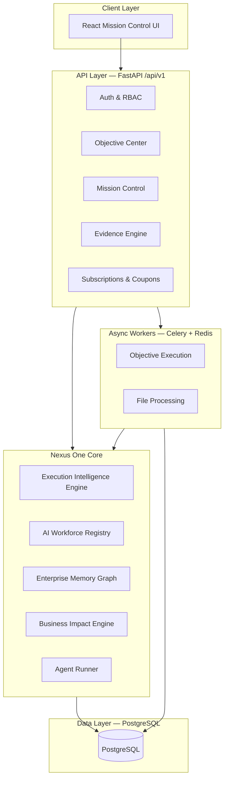
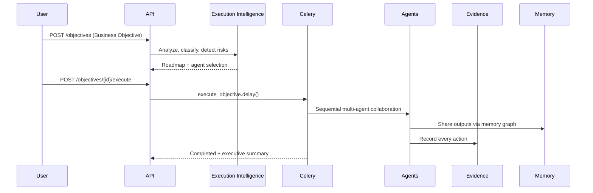

# Nexus One — Enterprise Architecture

## Vision

Nexus One is an **Enterprise Autonomous Execution Operating System**. Users define business objectives; the platform understands, plans, selects AI agents, executes work, tracks evidence, measures impact, and delivers executive summaries.

This is NOT a task manager, workflow tool, or chat application.

## System Architecture



## AI Workforce Organization

| Department | Agents |
|------------|--------|
| Executive | Executive Summary, Business Impact |
| Strategy | Planning, Research, Portfolio Manager |
| Data | Data Engineer, Analyst, Scientist, Modeler, AI Data Engineer |
| Engineering | Python Dev, Java Full Stack, Backend, Platform |
| Analytics | Power BI, Dashboard Intelligence |
| Infrastructure | Cloud, DevOps, Security |
| Quality | QA, Governance |

## Execution Flow



## Database Schema

Core tables (see `database/schema.sql` + `database/nexus_one_schema.sql`):

- **Identity**: `tenants`, `users`, `roles`
- **Objectives**: `business_objectives`, `projects`, `execution_phases`, `timeline_events`
- **Intelligence**: `objective_risks`, `executive_insights`, `memory_graph_nodes/edges`
- **Evidence**: `evidence_records`, `audit_logs`
- **Commercial**: `subscription_plans`, `tenant_subscriptions`, `coupons`, `coupon_redemptions`, `runtime_usage`

## API Design

| Endpoint | Purpose |
|----------|---------|
| `POST /api/v1/objectives` | Create & analyze business objective |
| `POST /api/v1/objectives/{id}/execute` | Start autonomous execution |
| `GET /api/v1/mission-control/dashboard` | KPI dashboard |
| `GET /api/v1/mission-control/workforce` | AI workforce board |
| `GET /api/v1/mission-control/evidence` | Evidence center |
| `GET /api/v1/mission-control/risks` | Risk center |
| `GET /api/v1/subscriptions/current` | Plan limits |
| `POST /api/v1/subscriptions/coupons/redeem` | Coupon redemption |

## Security Design

- JWT authentication on all `/api/v1/*` routes
- RBAC: role-based endpoint restrictions
- Multi-tenant isolation: all queries filter by `tenant_id`
- Audit logging for sensitive actions
- File uploads stored in tenant-scoped directories (paths never exposed)

## Subscription Plans

| Plan | Price | Runtime/day | Agents |
|------|-------|-------------|--------|
| Free | $0 | 5 min | 2 |
| Standard | $29 | 60 min | 5 |
| Professional | $99 | 8 hr | All |
| Business | $299 | 24 hr | All + teams |
| Enterprise | Custom | Unlimited | All |

Coupons: `WELCOME50`, `STARTUP25`, `EARLYACCESS`, `INVESTORDEMO`

## Deployment Architecture

```bash
cd docker && docker compose up --build
```

Services: `postgres`, `redis`, `nexus-api`, `nexus-worker`

Frontend:
```bash
cd frontend-react && npm install && npm run dev
```

## Investor Demo Flow

1. Sign up → creates tenant + admin user (Free plan)
2. Mission Control → view KPI cards and AI workforce board
3. Objective Center → enter "Build Customer Analytics Dashboard"
4. System analyzes → shows category, complexity, agents, risks
5. Execute → agents collaborate, evidence generated in real-time
6. Evidence Center → traceable actions with impact
7. Executive Insights → ROI analysis and recommendations
8. Redeem `INVESTORDEMO` coupon → extend trial

## Implementation Roadmap

| Phase | Status | Scope |
|-------|--------|-------|
| 1 | Done | Secure backend, auth, RBAC, multi-tenancy |
| 2 | Done | Objective Center, execution engine, workforce |
| 3 | Done | Evidence engine, memory graph, mission control APIs |
| 4 | Done | Subscriptions, coupons, Celery execution |
| 5 | Done | React Mission Control dashboard (dark mode) |
| 6 | Next | WebSocket real-time timeline updates |
| 7 | Next | LLM-powered agent reasoning (OpenAI/Anthropic integration) |
| 8 | Next | Power BI / external output connectors |
| 9 | Next | Team management & approval workflows |

## Folder Structure

```
nexus_one/                  # Core intelligence engines
backend/
  api/v1/                   # REST API routers
  db_models/                # SQLAlchemy ORM
  services/                 # Business logic
  workers/                  # Celery tasks
frontend-react/             # React Mission Control UI
database/
  schema.sql                # Base schema
  nexus_one_schema.sql      # Nexus One extension
docs/
  nexus_one_architecture.md # This document
```
